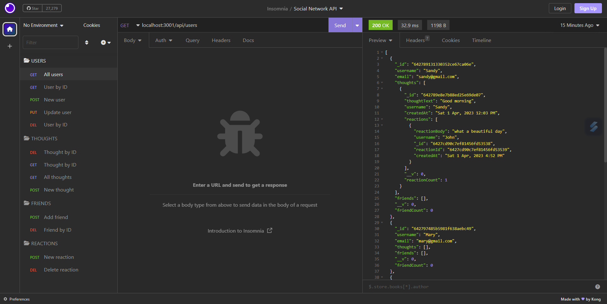

# Social Network API
  
  ## Description
  This is a backend code that connetcs database and API routes for social network site. The application allows users to post thoughts and add friends to their profile. Other users can react to a thought by posting reactions to an existing thought. User details can also be updated or deleted. 
  The database contains User, Thought, and Reaction where users can view, create, or delete their thought from the database. Below is a screenshot of the response to API requests in Insomnia:
  
  ## Table of Contents
  - [Description](#description)
  - [Usage](#usage)
  - [Installation](#installation)
  - [Contributing](#contributing)
  - [Questions](#questions)
  ## Usage
  You can view the response of each API request by testing the routes in Insomnia. Using GET request to retrieve data information of each model. To retrieve a specific user or thought, enter the id number in the url to selectively view one data. Use the POST request for creating new user, thought or reaction. Simply enter the values of the new data and send the url, then the new data will be added to the database. You can update the user details via PUT request, and delete the user with DEL request quoting their id number in the url. Here is a walkthrough video to demonstrate the usage of this application: [Link to walkthrough video](https://drive.google.com/file/d/1hhT0Vxu0zoF-o6sYRBLZg6RyWi3OMRbP/view)
  ## Installation
  The Social Network API Backend code requires Mongoose and Express packages to connect the database to API calls. Dayjs is used for formatting date and time. You will need to install the packages by entering "npm i" in visual studio command line. Once installed, run "npm run start" to start the application server. The various API request routes can then be tested in Insomnia.
  ## Contributing
  If you would like to contribute to this project, head to my GitHub page to see details of the application code. You can also contact me via my email below for any suggestions and feedback.
  ## Questions
  Check out my projects on my GitHub account at https://github.com/Sandy5433
  . If you have any questions about the application, you can reach me via my email at sandyhung83@yahoo.com.tw 
  